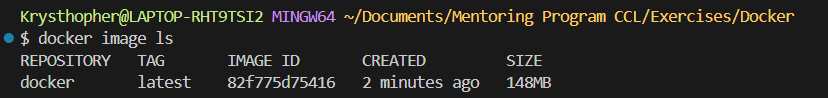

## this is a little notepad for Docker Course  ##

=> not meant to be a guide but just an overview of Docker Tutorial for Beginners === https://www.youtube.com/watch?v=pTFZFxd4hOI  <=

##  Topics   ##

What is Docker?
Virtual MAchines vs Containers
Architecture of Docker
Installing Docker
Development Workflow

## What is Docker? ##

Is a platform for building, running and shipping app, so your application works the same wy in other computers.

this solves common issues 
- one or more files missing in diff computers
- softWare version 
- diff config 

it works sending a package with all the needed fils (including soft version, configs, etc.)

we can remove the applications on our dev machines and it will be saved in docker (kind of a github)

// NutShell //

consistently build, rund, and ship applications across multiple devices

## Virtual MAchines vs Containers ##

Container  => an isolated environment for running applications
VM => virtual Machines => An abstraction of a machine (physical HardWare)

VM use hypervisor like virtual box 

VM benefits : run applicaiton isolations inside a VM, we can have 2 VM with 2 diff apps, using the same dependencies
VM Problems => Each vm need a full-blown OS  + Slow starts + resource intensive (since it takes hardware sources)

==== Containers ====

Benefits:
- allow running multiple apps in insolation
- are lightweight
- USe OS of the host
- start wuickly
- need less hadware resources

## Architecture of Docker ##

Client    ====>  Docker engine
        rest API

Containers are Process and use the Kernel of the host (kernel => OS)

we can run Win/linux containers in Windows
only linux continers in linux
and Linux vm in MAc

##  Installing Docker  ##

~ docker version  ==> shows the version of docker

we manually download and install = > https://docs.docker.com/get-docker/

> we needed to set up the window's subsystem to have Virtual MAchine platform as well as Windows Subsystem for linux -- https://acesse.dev/XWbRG <

GEt started information ==> https://docs.docker.com/guides/get-started/

##   Development Workflow  ##

Application => dockerize it (add DockerFile) => will contain everything that it needs to run => creates an image that we then sent to a container => start the container 

instead of running the app locally (my-App) we do it trough docker (docker run ...)

DEV    =>    Registry    =>   test/prod
we            github            client computer  ==== simplification

##    Docker in Action ##

>instructions<

- Starts with an OS
- Install Node
- Copy app files
- Run node app.js

docker build -t Docker .  > build the docker file thing (image) we wont see it

docker image ls => as in git basic commands ls is list items so here is the images

since the image contains alpine linux, node, it has a 148mb data

docker run [image name] => this will run the docker file, just like Node

> VM machine online to play with docker > https://labs.play-with-docker.com/p/cp153pgl2o9000frn6sg

alt + enter => makes it bigger

docker pull krysthecoder/[name] > just like github this will pull the image

the docker file = is basically a doc with instructions like the typeScript config file

##   Linux Comand Line  ##

Docker is built on basic linux commands
most tutorials are based on linux commands 

Linux ==> Open sources
Linux distributions => versions
- ubuntu
- debian
- alpine
- fedora
- Centos

==== we will use ubuntu on this notepad ====

we look for the offical image at =>  https://hub.docker.com/

instead of docker pull ubuntu => docker run ubuntu

docker ps -a => list the container/process

docker run -it ubuntu => it for interactable

basics commands
- echo hello
- whoami
- echo $0
- history
- apt

< apt uses the package intalled and we can work with it >

apt install => will look for what its inside
apt  update => wil update out package list
apt list => list what we have available to install

## Linux file system ##

Files are saved in a tree form

/bin-boot-dev-etc-hom-root-lib-var-proc

in linux everything is a file

[navigating-file-system]

lst = list
cd = change directory / use relative - cd boot

<comands-are-files-stored-bin-folder>

[manipulate-file]

mv = rename files folders or change then  => mv file1 renamed
touch = create stuff
rm = delete function
rm -r = delete recursevely

nano file1.txt = will create a file

cat [file] = will show the content
more [file] = will work like cat but its better for large files
less [file] = will work even better as it allow us to got and and down
head -n 5 [file] = will show the first few lines in this case 5

cat file1.txt > file2.txt == the > will redirect the content 1 to another file

